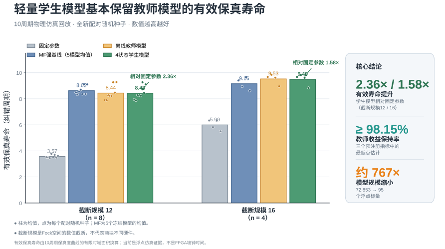
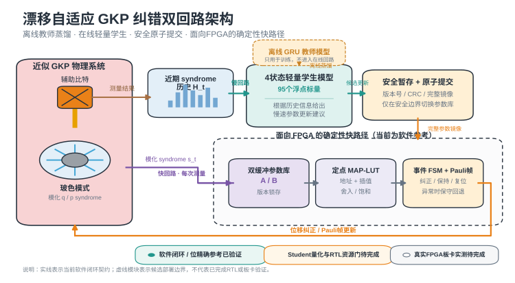

# 两幅 PPT 图的详细讲解与问答准备

> 用途：帮助汇报者在正式发言前理解“有效保真寿命柱状图”和“漂移自适应 GKP 纠错架构图”，并能应对老师对指标、数据、公平性、FPGA 状态和研究边界的追问。  
> 当前证据时间点：2026-07-16。  
> 建议 PPT 标题：**面向 FPGA 部署的单模 GKP 码漂移自适应双回路系统**。

---

## 1. 先记住整页 PPT 真正要表达什么

这页 PPT 不是要证明“我们的模型在任何条件下都比所有方法好”，也不是要证明“FPGA 已经完成并且测出了真实延迟”。它真正要表达的是下面这条较稳健、也更有说服力的主线：

> 固定参数的 GKP 纠错策略在环境或器件参数发生漂移后容易失配；大型带记忆教师模型能够学习更合适的控制策略，而一个只有 4 个内部状态、95 个浮点标量的轻量学生模型，能够保留教师模型绝大部分物理仿真收益。与此同时，项目已经建立了面向 FPGA 的定点 MAP-LUT、事件状态机、双缓冲参数库和安全提交软件合同，为后续真正的 RTL 和板卡实现做准备。

两幅图的分工非常明确：

- **架构图回答“系统怎样工作”**：信息如何从测量结果进入学生模型，参数如何安全更新，快路径如何输出纠正动作。
- **柱状图回答“为什么值得这样做”**：学生模型在有效保真寿命上接近教师模型，却把浮点模型规模压缩了约 767 倍。

回答老师问题时，建议始终使用“三步法”：

1. **先给结论**：一句话直接回答问题；
2. **再给证据**：说出图中的数字、实验口径或实现机制；
3. **最后给边界**：主动说明这是仿真、软件合同还是硬件实测，避免被认为夸大。

例如老师问“FPGA 做完了吗”，可以这样答：

> 还没有完成真实板卡实测。当前已经完成的是整数快路径、事件状态机、参数原子切换和闭环故障恢复的软件参考与位精确验证；Student 的量化、RTL、综合、时序收敛和真实板卡测量仍是下一阶段工作。

---

## 2. 建议直接放在 PPT 上的四行介绍

GKP 码运行中会受到噪声漂移影响，固定参数纠错器容易逐渐失配。  
本项目先用离线 GRU 教师模型学习带记忆的控制策略，再压缩为 4 状态、95 个浮点标量的轻量学生模型。  
在两种仿真截断规模下，学生模型将有效保真寿命提升至固定参数方案的 2.36 倍和 1.58 倍。  
学生模型至少保留 98.15% 的教师收益，同时浮点模型规模缩小约 767 倍，为后续 FPGA 低时延部署提供基础。

如果版面允许，建议在最下方再用小字补一句：

> 当前结果来自有限截断物理仿真和软件闭环验证；Student 量化、RTL 与真实 FPGA 板卡实测仍待完成。

---

## 3. 四行介绍应当怎样展开解释

### 第一句：为什么要研究“漂移适应性”

> GKP 码运行中会受到噪声漂移影响，固定参数纠错器容易逐渐失配。

通俗地说，纠错器通常需要根据“噪声大概有多强、偏差向哪个方向、测量有多不可靠”等信息选择参数。如果这些信息长期不变，一组固定参数可能表现不错；但真实系统中的器件偏置、噪声方差、读出误差或环境条件可能缓慢变化，也可能出现突变。此时，原来针对旧环境调好的纠错器就像一副度数已经不合适的眼镜，仍然能工作，但判断会越来越不准确。

因此，本项目关注的不只是某个静态噪声点上的最好成绩，而是：

- 环境发生变化后能不能发现变化；
- 能不能利用一段历史测量信息判断当前状态；
- 能不能安全更新控制参数；
- 更新过程中发生通信错误或参数损坏时，快路径是否仍能给出确定、安全的动作。

### 第二句：为什么需要教师—学生结构

> 本项目先用离线 GRU 教师模型学习带记忆的控制策略，再压缩为 4 状态、95 个浮点标量的轻量学生模型。

大型 GRU 教师模型擅长从一串历史观测中提取时间相关性，可以学习“最近连续出现了什么结果”“变化是偶然波动还是持续趋势”等信息。但是，它有 72,853 个浮点标量和约 72,266 次解析 MAC/half-cycle，直接放入低成本 FPGA 的实时路径并不现实，而且教师训练本身也不应该进入在线关键路径。

因此项目采用两阶段方法：

1. **离线 Teacher**：在训练阶段学习复杂的有记忆控制策略；
2. **在线 Student**：模仿教师的控制输出，但只保留 4 个递推状态和一个小型输出头。

这里的“4 状态”不是 4 个类别，也不是 4 层神经网络，而是学生模型在时间上持续保存的 4 个内部数值。它们可以理解成 4 个不同时间尺度的“简短记忆摘要”。学生模型更新形式是有界的指数递推，因此比大型 GRU 更容易分析，也更适合作为后续定点化候选。

需要注意：图中说的“95 个参数”更准确的叫法是 **95 个存储浮点标量**。它不是“95 个神经元”，更不是已经综合出来的 95 个 FPGA LUT。

### 第三句：性能优势具体在哪里

> 在两种仿真截断规模下，学生模型将有效保真寿命提升至固定参数方案的 2.36 倍和 1.58 倍。

这句话比较的是学生模型与固定参数 Standard 方案：

- 截断规模 12：`8.427107 / 3.570623 = 2.3601`，约为 **2.36 倍**；
- 截断规模 16：`9.489395 / 5.993625 = 1.5832`，约为 **1.58 倍**。

这里应说“提升至原来的 2.36 倍”，不要说“提升了 236%”。如果说百分比，分别约等于增加 136% 和 58%。

两个截断规模给出不同的倍数并不矛盾，因为它们是两个不同的有限 Fock 空间近似。更高截断规模会改变绝对寿命和各策略之间的相对差距。我们希望看到的不是两个数字完全一致，而是“学生模型接近教师、并明显高于固定参数方案”这一趋势在两个截断规模下都存在。

### 第四句：为什么“性能保持＋模型压缩”比单纯最高分更重要

> 学生模型至少保留 98.15% 的教师收益，同时浮点模型规模缩小约 767 倍，为后续 FPGA 低时延部署提供基础。

教师收益保持率的定义不是简单的 `Student / Teacher`，而是：

\[
\text{保持率}=\frac{\text{Student}-\text{Standard}}{\text{Teacher}-\text{Standard}}.
\]

这样计算是在问：“教师相对于固定参数方案多获得的那部分收益，学生保留下来了多少？”

以有效保真寿命为例：

- 截断规模 12：保持率约为 `99.74%`；
- 截断规模 16：保持率约为 `98.98%`。

图中写的 `≥98.15%` 更保守：它不是只看有效保真寿命，而是从 selection score、有效保真寿命和 logical-Z 有效寿命这三个预注册指标、两个截断规模的 6 个点估计中取最低值。最低值来自截断规模 16 的 logical-Z lifetime，等于 `98.1457%`。

模型规模的计算为：

\[
72853 / 95 = 766.87,
\]

因此写成“约 767 倍”。等价地说，存储浮点标量减少了 `99.8696%`。解析 MAC 数从 72,266 降到 87，减少了 `99.8796%`。

但这仍然只是浮点解析成本，不等于真实 FPGA 资源减少 767 倍。实际硬件还会包含定点位宽、状态寄存器、地址逻辑、BRAM 打包、CRC、FSM、FIFO 和路由开销。

---

## 4. 第一幅图：有效保真寿命柱状图

### 4.1 这幅图的核心结论

这幅图最应该突出的是：

> 4 状态学生模型在两个数值截断规模下都几乎复制了大型教师模型的有效保真寿命，同时明显优于固定参数方案；其价值主要体现在性能—复杂度折中，而不是在所有条件下都排名第一。

### 4.2 建议的讲图顺序

不要一上来就读所有数字。建议按照下面顺序：

1. 先说纵轴：“纵轴是有效保真寿命，越高表示量子信息在仿真中保持得越久。”
2. 再说横轴：“左右分别是 Fock 空间截断规模 12 和 16，用于检查结果是否过度依赖某一个有限截断。”
3. 再说颜色：“灰色是固定参数，蓝色是五个强 MF 基线的均值，黄色是大型离线教师，绿色是 4 状态学生。”
4. 指出核心视觉事实：“绿色柱几乎和黄色柱一样高，但模型规模从 72,853 个标量下降到 95 个。”
5. 最后补充严谨边界：“蓝色 MF 在截断 12 略高，而在截断 16 低于教师和学生，所以这里不声称学生模型普遍击败所有 MF 方法。”

### 4.3 “有效保真寿命”到底是什么

它不是“最后一个周期的保真度”，也不是实际硬件上的微秒或毫秒寿命。当前计算使用 10 个纠错周期内的保真度曲线，把曲线下面积换算成一个等效寿命。直观上可以理解为：

> 如果整个 10 周期内保真度都比较高，曲线下面积就大，对应的有效寿命也长；如果保真度很快下降，曲线面积就小，有效寿命也短。

使用曲线面积而不是只看终点有两个好处：

- 不会因为某一个终点的偶然波动就完全改变结论；
- 能同时反映早期下降速度和整个有限时间窗口内的平均保持情况。

但它也有局限：

- 目前只观察 10 周期，不能直接外推到 `10^3`、`10^5` 或 `10^6` 周期；
- 它是 finite-horizon area-equivalent lifetime，不是严格证明系统满足单指数衰减；
- 它以“纠错周期”为单位，不是硬件墙钟时间。

如果老师问为什么不直接叫“保真度”，可以回答：

> 单个时刻的保真度只是一张照片，有效保真寿命更像对整段保真度曲线做汇总，因此更适合比较控制策略在整个 10 周期内的保持能力。

### 4.4 四种方法分别是什么

| 图中名称 | 直观解释 | 在比较中扮演的角色 |
| --- | --- | --- |
| 固定参数 | 参数始终不随历史变化 | 最基本参照，体现漂移下失配的代价 |
| MF 强基线 | 无递归隐藏记忆的强学习基线；图中保留 5 个冻结模型并取均值 | 防止只与过弱方法比较 |
| 离线教师模型 | 72,853 标量的 GRU 教师，可利用历史信息 | 提供高容量、有记忆的性能参考 |
| 4 状态学生模型 | 95 标量的指数递推 Student | 本项目当前最有部署价值的候选路线 |

MF 可以理解为 Markovian feedback：它可以根据当前输入给出控制，但没有像 GRU 或递推 Student 那样持续保存并更新隐藏记忆。这里的 MF 不是随意选的弱模型，而是保存了 5 个冻结 agent 的结果，没有在测试集上只挑最好的一个。

### 4.5 图中全部主要数字

| 截断规模 | 固定参数 | MF 强基线均值 | 离线教师 | 4 状态学生 |
| --- | ---: | ---: | ---: | ---: |
| 12 | 3.570623 | 8.622787 | 8.439925 | 8.427107 |
| 16 | 5.993625 | 9.155712 | 9.525396 | 9.489395 |

从这张表可以读出三层信息：

1. 学生相对固定参数的提升很明显；
2. 学生与教师非常接近；
3. 教师/学生与 MF 的排序随截断规模发生变化，所以不能说“带记忆模型永远胜过 MF”。

### 4.6 柱和散点分别代表什么

- **柱高**：对应方法在独立随机种子上的均值；
- **小圆点**：每个 paired seed 对应的结果；
- 截断 12 的 `n=8` 指 8 个独立 evaluation seeds；
- 截断 16 的 `n=4` 指 4 个独立 confirmation seeds。

这里的 `n` 不是单条量子轨迹数量。完整 10 周期评估包含 5,760 条 policy trajectories，但统计独立单位仍是 seed cluster。老师如果问样本量，不能只回答“有 5,760 条轨迹”，否则会把同一 seed 下的轨迹错误地当成完全独立重复。

可以这样回答：

> 主截断使用 8 个新 seed、每个 seed 64 条轨迹；确认截断使用 4 个新 seed、每个 seed 32 条轨迹。图上的点按 seed 汇总，所以 n 写 8 和 4。总轨迹数较多，但统计独立性主要来自这些 seed cluster，确认组样本量仍然有限，后续需要更大规模验证。

### 4.7 为什么没有给每根柱画传统误差棒

这张 PPT 图优先让非专业听众看懂，因此使用原始 seed 点展示波动，没有额外叠加复杂误差棒。正式证据中对 Student 相对 Teacher-vs-Standard 的收益保持率进行了 20,000 次 paired-seed bootstrap。

六个预注册保持率结果为：

| 截断规模 | 指标 | 点估计 | 配对 bootstrap 95% CI |
| --- | --- | ---: | ---: |
| 12 | selection score | 99.8481% | [99.0787%, 100.4547%] |
| 12 | fidelity lifetime | 99.7368% | [98.7511%, 100.4886%] |
| 12 | logical-Z lifetime | 99.6557% | [98.2442%, 100.8014%] |
| 16 | selection score | 98.7812% | [96.7051%, 99.9901%] |
| 16 | fidelity lifetime | 98.9806% | [97.3811%, 99.9138%] |
| 16 | logical-Z lifetime | 98.1457% | [94.4501%, 100.0600%] |

注意两个容易说错的地方：

- 图中的 `≥98.15%` 是最低**点估计**，不是最低置信区间下界；最低 95% CI 下界是 `94.45%`。
- 置信区间上界略高于 100% 并不表示概率超过 100%，因为这里估计的是两个收益差值的比值，bootstrap 波动可以使比值略高于 1。

### 4.8 为什么 MF 在截断 12 反而略高

截断 12 中，MF 有效保真寿命均值为 8.622787，高于教师的 8.439925 和学生的 8.427107；截断 16 中，教师和学生分别为 9.525396 和 9.489395，高于 MF 的 9.155712。

这不是需要隐藏的“坏数据”，而是很重要的反证。它说明：

- 当前结果不支持“记忆模型在所有模型分辨率下都优于 MF”；
- 当前最稳健的贡献是“Student 高保真复现 Teacher，同时大幅压缩成本”；
- 如果老师追问排名，应主动承认排序反转，而不是只挑截断 16 讲。

建议回答：

> 我们没有把论文主张设成“Student 普遍击败 MF”。截断 12 的 MF 均值确实略高，而截断 16 的教师和学生更高。当前通过的主张是 Student 在两个截断和三个预注册指标上都保留了教师相对固定方案的大部分收益，这一性能—复杂度折中更稳定。

---

## 5. 第二幅图：漂移自适应 GKP 纠错架构

### 5.1 这幅图的核心结论

这幅图不是神经网络内部结构图，而是控制系统的数据流图。它要说明：

> 复杂学习发生在离线或慢回路，逐次测量的关键快路径保持为确定的整数查表和状态机；参数更新必须经过完整性检查和原子切换，通信或参数异常时快路径不等待主机，而是保持或回退到安全动作。

### 5.2 从左到右逐块解释

#### 1. 近似 GKP 物理系统

左侧粉色框代表当前仿真中的单模 GKP 系统，包括辅助比特和承载逻辑信息的玻色模式。辅助比特与玻色模式相互作用后产生 syndrome 测量结果，纠错器根据这些结果估计误差并给出位移或 Pauli 帧更新。

这里的“近似”很重要：当前不是实际 cavity/transmon 实验，而是有限能量、有限 Fock 截断的物理仿真模型。

#### 2. 近期 syndrome 历史

单次测量可能有随机性，只看一个结果很难判断环境是否真的漂移。历史模块把最近一段 `g/e`、syndrome 和健康状态信息整理成序列或窗口，为慢回路提供时间上下文。

通俗类比：单日气温不能判断季节变化，但连续多天的记录能帮助判断趋势。

#### 3. 离线 GRU 教师模型

教师模型只在训练阶段使用。它容量大、表达能力强，可以学习怎样根据历史信息调整 15 维控制残差。图中使用虚线和“只用于训练，不进入在线回路”，是为了强调大型模型不会直接进入逐次测量的关键路径。

#### 4. 4 状态轻量学生模型

学生模型保存 4 个内部递推状态，并通过一个小型输出头产生控制建议。其输入只来自允许的观测历史，不读取 logical truth、oracle 或未来信息。出现 leakage、CRC 错误、过期参数或 deadline miss 时，当前浮点 Student artifact 会清空状态并返回全零 residual，属于 fail-closed 行为。

图中绿色箭头写“候选更新”，因为 Student 的浮点收益保持已经通过，但 Student 的定点化、资源综合和真实硬件接入尚未完成。这个箭头表示目标连接，而不是板卡实测事实。

#### 5. 安全暂存与原子提交

慢回路不能一边计算、一边逐字段改写正在工作的参数，否则快路径可能同时读到一半旧参数、一半新参数。项目使用 A/B 双缓冲思想：

1. 当前 active bank 继续工作；
2. 新参数先写入独立 transfer buffer；
3. 检查长度、版本、CRC32、SHA256 和完整镜像；
4. 完整候选写入 inactive bank；
5. 到安全周期边界时只切换 active 指针；
6. 主机再通过 readback 确认真正激活的 bank、version 和哈希。

这就是“原子提交”：外部观察到的不是逐字段变化，而是从完整旧版本一次切换到完整新版本。

#### 6. 双缓冲参数库 A/B

A/B 两个参数库让系统在准备新版本时仍可使用旧版本。已进入五级流水线的请求会锁存旧 image/version，提交后新请求才读取新版本，因此不会出现同一个请求前半程用旧表、后半程用新表的情况。

#### 7. 定点 MAP-LUT

MAP 是 maximum a posteriori，即最大后验判断。它比较不同逻辑误差类别在当前 syndrome 下哪一个概率更大。

如果每次在线都重新计算高斯概率、指数和对数，硬件代价和延迟会比较大。MAP-LUT 的思路是：

- 慢路径预先计算并编译查找表；
- 快路径只做地址拆分、两个表项读取、整数插值和符号判断；
- 非负 LLR 选择不翻转，负 LLR 选择对应的 X 或 Z 翻转。

当前软件合同使用 10-bit ADC、8-bit 地址、2-bit fraction、22-bit signed Q9.12 LLR，每个相位 257 个表项。完整 16,384 个 ADC/bank/phase 组合中，量化 hard action mismatch 为 0。但这仍然是整数软件参考，不是 RTL 综合结果。

#### 8. 事件 FSM 与 Pauli 帧

FSM 是 finite-state machine，即有限状态机。它不只是照搬 MAP 的一次判断，而是结合 `g/e/leakage`、连续异常次数、CRC、参数新鲜度和 deadline 等信息，决定当前应当：

- 正常纠正；
- 进入 X 或 Z recovery；
- 暂停纠正并保持 frame；
- 请求 reset；
- 进入保守 fallback。

Pauli 帧可以理解成一份“逻辑上已经发生哪些 X/Z 修正”的数字账本。更新 Pauli 帧不等于已经真实发出了微波脉冲；当前架构验证的是数字逻辑表示和动作合同。

#### 9. 位移纠正或 Pauli 帧更新

右下角橙色回路表示快路径产生的纠正动作重新作用于系统。这里可以是物理位移控制的目标值，也可以是逻辑 Pauli 帧的数字更新。当前证据主要覆盖后者的整数软件合同，不能说已经完成真实模拟前端和量子装置闭环。

### 5.3 快回路和慢回路有什么区别

| 对比 | 快回路 | 慢回路 |
| --- | --- | --- |
| 作用 | 每次测量都要给出确定动作 | 根据较长历史更新模型或参数 |
| 当前参考周期 | 每个配置 epoch 5 μs、II=1 | 每 4000 cycles，即 20 ms 发出窗口 |
| 主要模块 | MAP-LUT、health、FSM、Pauli frame | 历史窗口、Student/估计、参数编译 |
| 失败处理 | 立即 hold/fallback，不等待 host | 失败结果不提交，继续使用 last-known-good |
| 当前证据 | 位精确软件合同 | 软件 cadence 与候选 Student 浮点证据 |
| 是否实板测量 | 否 | 否 |

慢回路故意不进入逐次测量关键路径。即使主机暂停、通信中断或更新失败，快回路仍然继续执行旧的有效参数或进入保守状态，而不是停下来等待主机。

### 5.4 当前关于“延迟”能说到什么程度

当前有三类软件时序数字：

1. MAP-LUT 为固定 5 级软件流水线；
2. 事件 FSM 再经过 1-cycle action register，所以 source-to-action 为固定 6 个软件 cycles，II=1；
3. 慢回路的漂移适应延迟取决于等待窗口和计算服务：
   - 首个包含变化样本的窗口口径：`1.000–20.995 ms`；
   - 首个完全由变化后样本组成的窗口口径：`11.235–31.230 ms`。

这些数字都来自配置周期和软件执行合同。不能把“6 cycles”自动换成真实 FPGA 纳秒延迟，也不能把当前配置中的 `5 μs` 当作已经测得的 Fmax。

建议回答：

> 当前能证明的是固定的流水级数和软件 cadence，不是板卡实测时间。真正的硬件延迟还要经过 RTL 仿真、综合、布局布线和板级 I/O 测量，并区分 core latency、transport latency 和端到端 latency。

### 5.5 当前软件闭环已经验证了什么

架构图底部绿色标签对应的证据包括：

- 选定定点配置完整网格 hard action mismatch 为 `0/16,384`；
- 定点链相对 float 的 paired `ΔLER = 3.05176e-5`，95% CI 跨零，说明当前 matched trace 上未观察到明确退化或提升；
- 8 场景 × 4 seeds 的闭环故障 campaign 共运行 `767,872` 个 software cycles；
- undefined action、blocking-fault correction 和 frame overflow 均为 0；
- 覆盖 burst、leakage/reset、host timeout、通信暂停、坏包、更新竞争和 last-known-good 内容重新发布。

这些结果说明数字控制逻辑具有良好的确定性和 fail-closed 行为，但不直接证明物理保真度或逻辑寿命在这些故障下仍然改善。

### 5.6 这张架构图最容易被误读的地方

图中把 Student 慢回路与 MAP-LUT/FSM 快路径放在同一个系统设计中，是为了表达目标架构和接口关系。当前证据成熟度并不完全相同：

- Student：已经通过浮点蒸馏和有限模型物理收益保持；
- MAP-LUT/FSM/双参数库：已经通过整数或位精确软件合同和故障压力验证；
- Student 到定点参数镜像的完整量化与资源门：尚未完成；
- RTL、综合、post-route timing、真实低成本 FPGA 板卡：尚未完成。

因此，如果老师问“这是不是一个已经端到端跑通的 FPGA 系统”，正确回答是：

> 这是当前软件证据和候选部署接口形成的目标架构。各个关键软件合同已经分别验证，但 Student 定点化到真实 FPGA 的端到端硬件闭环仍未完成。

---

## 6. 两幅图怎样连成一个完整故事

可以用下面的逻辑连接两幅图：

1. **先提出问题**：漂移会使固定参数纠错器失配；
2. **再讲方法**：大型离线教师学习历史依赖，轻量学生保留记忆并产生慢速更新；
3. **再讲部署原则**：逐次测量的快路径不运行大型神经网络，而是使用定点查表、FSM 和安全参数库；
4. **最后给性能证据**：Student 在两个截断规模下接近 Teacher，相对 Standard 的有效寿命达到 2.36 倍和 1.58 倍；
5. **落到工程价值**：浮点模型规模约缩小 767 倍，使后续定点化和低成本 FPGA 部署更有希望；
6. **主动说明边界**：当前仍是有限模型仿真与软件合同，不能写成真实板卡或量子实验结论。

一句很适合在两幅图之间过渡的话是：

> 左图说明我们怎样把复杂的有记忆策略拆成慢速学习和确定性快路径；右图进一步说明，这种压缩并没有明显牺牲教师模型在有限物理仿真中的收益。

---

## 7. 三种时长的发言稿

### 7.1 约 30 秒版本

> 固定参数 GKP 纠错器在噪声漂移后容易失配。我们先用离线 GRU 教师从历史 syndrome 中学习有记忆的控制策略，再蒸馏为只有 4 个内部状态和 95 个浮点标量的学生模型。学生模型在两个 Fock 截断规模下，将有效保真寿命提升到固定方案的 2.36 倍和 1.58 倍，并至少保留 98.15% 的教师收益。在线关键路径采用定点 MAP-LUT、事件 FSM 和双参数库，但目前仍是仿真和软件闭环证据，真实 FPGA 板卡验证尚未完成。

### 7.2 约 2 分钟版本

> 这项工作的出发点是漂移。固定参数纠错器相当于只针对一个噪声环境调参，一旦器件偏置或噪声统计随时间变化，就可能逐渐失配。我们采用教师—学生结构：大型 GRU 教师只在离线阶段学习历史依赖，在线候选则是一个 4 状态、95 标量的指数递推学生模型。  
> 架构上，我们把慢回路和快回路分开。慢回路根据近期 syndrome 历史产生候选参数；候选必须经过版本、CRC 和完整镜像检查，并通过 A/B 双缓冲原子切换。逐次测量的快路径只做定点 MAP 查表、整数插值、事件 FSM 和 Pauli 帧更新，异常时保持或回退，不等待主机。  
> 性能图中，学生模型在截断 12 和 16 下的有效保真寿命分别为 8.43 和 9.49，而固定参数方案只有 3.57 和 5.99，对应 2.36 倍和 1.58 倍。学生几乎与教师重合，并且六个预注册保持率点估计中最低仍为 98.15%。与此同时，浮点存储标量从 72,853 降到 95，约缩小 767 倍。  
> 需要强调的是，截断 12 下 MF 均值略高，因此我们不声称 Student 普遍优于所有 MF；另外目前还没有真实板卡时序和资源结果，当前结论限于有限模型仿真与软件闭环。

### 7.3 约 5 分钟版本

> GKP 是把逻辑信息编码在振子相空间栅格结构中的玻色量子纠错码。解码和控制依赖 syndrome 的统计特征，因此当噪声均值、方差、相关性或读出状态随时间变化时，固定参数策略容易失配。我们的目标是让系统既能利用历史信息适应漂移，又不把大型神经网络直接塞进逐次测量的实时路径。  
> 方法上，首先训练一个有记忆的 GRU 教师模型。它有 72,853 个浮点标量，能够利用观测历史产生 15 维有界控制残差。随后在严格分离的 training、validation 和 evaluation 轨迹上蒸馏 1、2、4 状态候选，只依据 validation 选择模型。最终选中 4 状态、95 标量 Student；evaluation 模仿误差约为 `6.08×10^-6`。但模仿误差小不等于物理效果好，因此又使用全新 paired seeds 做 10 周期物理回放。  
> 柱状图报告有效保真寿命，也就是把 10 周期保真度曲线面积换成等效寿命。截断 12 下，Standard、MF、Teacher 和 Student 分别为 3.57、8.62、8.44 和 8.43；截断 16 下分别为 5.99、9.16、9.53 和 9.49。Student 相对 Standard 达到 2.36 倍和 1.58 倍；对三个预注册指标和两个截断的收益保持率最低点估计为 98.15%，最低 bootstrap 95% CI 下界为 94.45%。这支持“Student 保留 Teacher 收益”，但不支持“Student 或 NMF 在任何条件下都优于 MF”，因为 MF 与 Teacher 的排序在两个截断之间发生了反转。  
> 架构图展示的是部署思路。Student 位于慢回路，根据近期 syndrome 历史产生候选更新；新参数必须完整写入 inactive bank，并通过版本、CRC、SHA 和安全边界检查后原子切换。逐次测量快路径使用定点 MAP-LUT，随后由事件 FSM 处理连续 e、leakage、reset 和 health fault，最终更新 Pauli frame 或保持安全状态。当前整数软件参考在 16,384 个穷举点上没有 hard action mismatch，闭环故障 campaign 的 767,872 个软件周期中也没有未定义动作或故障状态下错误纠正。  
> 工程价值在于把浮点模型从 72,853 个标量压到 95 个，约缩小 767 倍，同时保留大部分有限模型物理收益。但目前这只是浮点成本、位精确软件路径和配置时序合同；Student 量化、RTL、综合、布局布线、传输和真实 Tang Nano 20K 板卡测量仍是后续工作。

---

## 8. 老师可能提出的问题与建议回答

### Q1：为什么不继续叫“CNN+FPGA”系统？

**建议回答：**

> 项目早期路线是 classical teacher 加 Tiny-CNN residual，但当前证据更强的主分支已经推进为离线 GRU Teacher 加 4 状态递推 Student。FPGA 部分目前仍是 FPGA-facing 快路径和软件合同，因此新的标题更准确地写成“教师—学生模型与面向 FPGA 的双回路系统”。

如果旧版 PPT 仍出现“CNN+FPGA”，应主动说这是旧命名，避免老师认为图和文字对应不上。

### Q2：为什么教师模型不能直接在线运行？

**建议回答：**

> 教师模型的作用是离线探索高容量、有记忆的控制策略，不是逐次测量执行器。它有 72,853 个浮点标量和约 72,266 个解析 MAC/half-cycle，直接放入低成本 FPGA 会增加资源、时序和验证压力。蒸馏后 Student 只需 95 个标量和 87 个解析 MAC/healthy half-cycle，更适合作为后续定点化候选。

### Q3：为什么最后是 4 状态，而不是 1 状态或 2 状态？

**建议回答：**

> 项目同时训练了 1、2、4 状态候选，每个维度有 3 个独立 restart，只根据 validation MSE 选择。4 状态是唯一进入预设 eligibility threshold 的候选，validation/evaluation MSE 分别约为 `5.65×10^-6` 和 `6.08×10^-6`；1、2 状态误差明显更高。因此 4 状态不是看测试结果后随意挑选的。

### Q4：4 状态是不是说明系统只有四种工作模式？

**建议回答：**

> 不是。4 状态指 Student 的四个连续内部记忆变量；事件 FSM 另外有 normal、X recovery、Z recovery、hold、reset request 和 fallback 六种离散模式。二者作用不同：Student 状态用于概括历史，FSM 模式用于执行安全动作。

### Q5：95 个参数具体是什么？

**建议回答：**

> 更准确地说是 95 个存储浮点标量，包括 outcome-specific 递推参数和 15 维输出头。按 float32 只需 380 bytes，但当前没有计入定点位宽、寄存器、状态机、CRC 和地址逻辑，所以不能把 380 bytes 直接当作最终 FPGA 资源。

### Q6：约 767 倍缩小是不是 FPGA LUT 或功耗也缩小 767 倍？

**建议回答：**

> 不是。767 倍只来自浮点 stored scalars 的解析比值 `72,853/95`。它说明模型本体大幅简化，但实际 LUT、FF、BRAM、乘法器、Fmax、功耗和板级延迟必须由目标器件综合和实测给出。

### Q7：有效保真寿命与逻辑错误率有什么关系？

**建议回答：**

> 两者都反映纠错效果，但视角不同。逻辑错误率统计错误事件，有效保真寿命则汇总一段时间内保真度曲线的保持能力。本页选择有效保真寿命，是因为它更直观地回答“信息能保持多久”，且当前 Teacher-Student 物理回放已经直接报告该指标。后续完整验证仍应同时报告 LER、tail risk、logical-Z lifetime 和 oracle gap。

### Q8：为什么不继续使用旧图里平均降低 2.32% 的 LER proxy？

**建议回答：**

> 旧结果来自较早的 mock-backed software-HIL 比较，重复数和物理证据层级都较弱。当前 Teacher-Student gain-retention 使用全新 paired seeds、两个 Fock 截断和 10 周期物理回放，而且同时给出强 MF 基线和模型成本，所以更适合作为当前项目的主结果。

### Q9：Cutoff 12 和 16 是什么意思？

**建议回答：**

> 振子 Hilbert 空间本来是无限维的，数值仿真必须截断。12 和 16 表示保留的 Fock 空间规模。它们不是两块硬件，也不是两个噪声强度；使用两个截断是为了检查结论是否只依赖某一个数值近似。

### Q10：为什么截断 12 和 16 的 Standard 寿命差别很大？

**建议回答：**

> 改变 Fock 截断会改变有限模型对态、噪声和控制的表示，因此绝对寿命可以变化。当前证据关注的是同一截断内的公平配对比较，以及 Student 是否在两个截断中都接近 Teacher，而不是要求两个截断的绝对数值相同。

### Q11：n=8 和 n=4 会不会太少？

**建议回答：**

> 对确认性结论来说仍然偏小，尤其 cutoff 16 只有 4 个 seed cluster，所以当前只做有界 claim。优势是所有模型使用配对的新 seeds，并对收益保持率做了 20,000 次 paired bootstrap；完整评估共有 5,760 条 policy trajectories。后续仍需要增加 seeds、覆盖更多模型失配和更长时域。

不要回答“轨迹很多，所以 n 不小”。轨迹嵌套在 seed 下，不能替代独立 seed cluster。

### Q12：Student 是不是在所有方法中最好？

**建议回答：**

> 不是。cutoff 12 下五个 MF agent 的平均有效寿命略高于 Teacher 和 Student；cutoff 16 下 Teacher/Student 更高。我们当前主张的是 Student 高比例保留 Teacher-vs-Standard 收益并大幅压缩模型，而不是普遍排名第一。

### Q13：98.15% 到底是什么？

**建议回答：**

> 它是六个预注册点估计中的最低教师收益保持率，定义为 `(Student-Standard)/(Teacher-Standard)`。它来自 cutoff 16 的 logical-Z lifetime。只看图中有效保真寿命时，保持率分别是 99.74% 和 98.98%。最低 bootstrap 95% CI 下界是 94.45%，不要把二者混淆。

### Q14：为什么保持率置信区间有时超过 100%？

**建议回答：**

> 保持率是两个差值的比值，不是概率。bootstrap 重采样时 Student 的估计收益可能略高于 Teacher，因此区间上界可以略超过 1，这不违反概率范围。

### Q15：测试集有没有用于选模型或调阈值？

**建议回答：**

> 没有。Teacher 选择、Student 状态维数和 restart 都在 evaluation 之前冻结；T4.4.4 使用没有参与训练或蒸馏的新 paired seeds。保持率 90% 的点估计和 CI 下界门也在运行前预注册，没有根据结果事后降低。

### Q16：MF 强基线是什么，为什么要放进去？

**建议回答：**

> MF 是无递归隐藏记忆的 Markovian feedback 学习基线。它与教师使用相当的浮点参数预算，并保留了 5 个冻结 agent，图中取它们的均值。加入它是为了避免只与固定参数或过弱方法比较，也能检验历史记忆是否在不同有限模型下都稳定带来优势。

### Q17：MAP-LUT 是不是神经网络？

**建议回答：**

> 不是。MAP-LUT 是把概率模型离线编译成查找表，在线只做整数地址、读取、插值和符号判断。它属于确定性的解码快路径，可以作为 Student 部署失败时的安全 fallback，也适合 FPGA 实现。

### Q18：为什么需要 CRC 和 SHA256 两种检查？

**建议回答：**

> CRC32 适合快速检测偶然传输错误，SHA256 用于更强的完整性对照。二者都不是身份认证或数字签名，但组合使用可以防止残缺、损坏或语义不一致的参数镜像被激活。

### Q19：原子切换为什么重要？

**建议回答：**

> 如果在线逐字段修改参数，快路径可能读到新旧混合状态。原子切换先在 inactive bank 准备完整镜像，验证后只切换 active 指针；已进入流水线的请求继续使用锁存的旧版本，新请求才用新版本，因此更新边界确定且可追溯。

### Q20：Pauli 帧更新是不是等于已经作用了物理纠错脉冲？

**建议回答：**

> 不是。Pauli 帧是数字逻辑中的纠错账本，记录逻辑上应如何解释后续结果。真实微波、DAC、IQ、cavity/transmon 控制不在当前证据范围内。

### Q21：FPGA 现在做到什么程度？

**建议回答：**

> 已冻结低成本目标板 Tang Nano 20K，并完成整数 MAP-LUT、位精确快路径、事件 FSM、A/B 参数库、原子提交和闭环故障恢复的软件参考。当前实物状态仍是未采购或未物理验证；现有 HIL 配置也仍是 mock/ZCU111 placeholder，不是 Tang Nano 20K 实板路径。

### Q22：为什么可以说“低时延部署基础”，却不能说“低延迟已经实现”？

**建议回答：**

> 因为当前证明了模型压缩、固定流水级数、II=1 和快慢回路分离，这些都是低时延设计的必要条件；但真实纳秒或微秒延迟还受 Fmax、布局布线、接口传输和板卡实现影响，所以只能说提供基础，不能说已经实测实现。

### Q23：系统发生通信中断时会怎样？

**建议回答：**

> 快路径不会等待主机。当前 active image 或 last-known-good 内容继续工作；参数过期、CRC 错误或 deadline miss 时进入 frame hold/fallback。通信恢复后必须 readback 核对 bank、version、CRC 和 SHA，再确认提交状态。

### Q24：系统是否已经证明 leakage 鲁棒性？

**建议回答：**

> 还没有证明原生 multilevel leakage 鲁棒性。当前 Student 训练使用 two-level ancilla，外部 leakage token 只触发清状态、零 residual 或 FSM reset/fallback；这证明数字安全分支存在，不等于模型学习了真实多能级 leakage 动力学。

### Q25：OOD 和长时间稳定性做完了吗？

**建议回答：**

> 还没有。当前收益保持是 matched two-level、finite-cutoff、10-cycle 的结果。未见 drift family、模型失配、长时状态有界性和 `10^3/10^5/10^6` cycles 外推属于后续 T5.4 证据门。

### Q26：下一步最关键的工作是什么？

**建议回答：**

> 第一是完成跨噪声、OOD、leakage 和长时验证，确认 Student 优势不会在模型失配下消失；第二是完成 Student 定点化和资源/时序综合；第三是实现 Tang Nano 20K 的传输与 RTL 路径，并分别测 core、transport 和端到端延迟；最后才能把 FPGA-facing claim 升级为真实板卡结论。

---

## 9. 可以说什么，不能说什么

| 推荐说法 | 不推荐或禁止说法 | 原因 |
| --- | --- | --- |
| Student 在两个有限截断和三个预注册指标上高比例保留 Teacher-vs-Standard 收益 | Student 在所有场景都优于所有方法 | MF 排序随 cutoff 反转，OOD/长时未完成 |
| 有效保真寿命在当前 10 周期仿真中提升至 2.36 倍和 1.58 倍 | 量子存储寿命在真实装置上提升了 2.36 倍 | 当前不是设备实验，也不是墙钟时间 |
| 浮点模型 stored scalars 约缩小 767 倍 | FPGA 资源或功耗降低 767 倍 | 尚无综合和板测 |
| Student 是后续低成本 FPGA 部署候选 | Student 已经部署到 FPGA | Student 量化、RTL 和板卡路径未完成 |
| MAP-LUT/FSM 是位精确软件参考和确定性时序合同 | 已达到 6-cycle FPGA 实测延迟 | 6 cycles 来自软件 pipeline contract |
| 闭环故障 campaign 中无未定义动作 | 已证明真实量子系统在故障下稳定 | campaign 验证数字动作安全，不是物理 lifetime |
| leakage 输入会触发安全回退 | 已学习并纠正真实 multilevel leakage | 当前训练模型是 two-level ancilla |
| Tang Nano 20K 是冻结的参考目标板 | 项目已在 Tang Nano 20K 上验证 | 当前实物和适配路径尚未验证 |

---

## 10. 最需要背下来的数字

### 性能数字

- Cutoff 12：Standard `3.57`，MF `8.62`，Teacher `8.44`，Student `8.43`；
- Cutoff 16：Standard `5.99`，MF `9.16`，Teacher `9.53`，Student `9.49`；
- Student/Standard：`2.36×`、`1.58×`；
- fidelity gain retention：`99.74%`、`98.98%`；
- 六个预注册指标最低点估计：`98.15%`；
- 最低 bootstrap 95% CI 下界：`94.45%`。

### 模型数字

- Teacher：`72,853` stored scalars，`72,266` analytic MAC/half-cycle；
- Student：`4` states，`95` stored scalars，`87` analytic MAC/healthy half-cycle；
- stored scalars 比值：约 `767×`；
- Student float32 参数本体：约 `380 bytes`，但不是完整 FPGA 存储。

### 评估数字

- Cutoff 12：8 个新 seeds，每个 64 trajectories；
- Cutoff 16：4 个新 seeds，每个 32 trajectories；
- 10-cycle policy trajectories 总数：`5,760`；
- paired bootstrap：`20,000` 次。

### 软件快路径数字

- MAP-LUT：5 个软件 pipeline stages；
- MAP + FSM action register：source-to-action 6 software cycles，II=1；
- selected 定点网格：`0/16,384` hard action mismatch；
- 故障闭环 campaign：`767,872` software cycles；
- undefined action、blocking-fault correction、frame overflow：均为 `0`。

---

## 11. 现场回答问题的技巧

### 11.1 不知道细节时，不要猜硬件数字

如果老师问“到底用了多少 LUT、跑多少 MHz、延迟多少纳秒”，当前正确回答不是临时估算，而是：

> 这些需要目标器件的综合和 post-route 报告，目前项目只冻结了表示位数和软件流水线合同，硬件资源与实测时间尚未产生。

### 11.2 遇到反例时主动承认，再收回到正确主张

例如老师指出 cutoff 12 的 MF 更高，可以回答：

> 是的，这正是我们保留的反证，所以没有声称 NMF 普遍优于 MF。当前更稳定的贡献是轻量 Student 对 Teacher 收益的高比例保持，以及明显更好的模型复杂度。

这比强行解释“差距不大所以算赢”更可信。

### 11.3 区分三种“已经完成”

现场回答时，可以把成熟度分成三层：

1. **已经完成的有限模型仿真结论**：Teacher-Student 收益保持；
2. **已经完成的软件工程合同**：定点 MAP-LUT、FSM、参数原子库和故障闭环；
3. **尚未完成的硬件证据**：Student 定点部署、RTL、综合、post-route 和实板。

### 11.4 避免把“候选架构”说成“单一端到端实验”

架构图整合了不同任务形成的接口和目标路径。可以说“各软件模块和接口合同已经建立”，但不要说“图中整条链已经在真实硬件上端到端验证”。

---

## 12. 最后一页式速记卡

如果上台前只剩一分钟，记住下面六句话：

1. 漂移会让固定参数纠错器逐渐失配。
2. 大型 GRU Teacher 离线学习历史依赖，4 状态 Student 在线保留简短记忆。
3. Student 有效寿命是 Standard 的 2.36 倍和 1.58 倍。
4. Student 至少保留 98.15% 的 Teacher-vs-Standard 点估计收益，但不保证普遍击败 MF。
5. 浮点 stored scalars 从 72,853 降到 95，约缩小 767 倍。
6. 当前是有限模型仿真和软件闭环；真实 FPGA 资源、时序和板测仍待完成。

---

## 13. 主要证据来源

- Teacher-Student 物理收益保持：[`../reports/phase4/teacher_student_gain_retention.md`](../reports/phase4/teacher_student_gain_retention.md)
- Teacher-Student 允许/禁止主张：[`../reports/phase4/teacher_student_branch_freeze.md`](../reports/phase4/teacher_student_branch_freeze.md)
- 4 状态 Student 蒸馏：[`../reports/phase4/low_dimensional_student_distillation.md`](../reports/phase4/low_dimensional_student_distillation.md)
- 定点 MAP-LUT：[`../reports/phase4/parametric_map_lut.md`](../reports/phase4/parametric_map_lut.md)
- 事件 FSM：[`../reports/phase4/experimental_event_fsm.md`](../reports/phase4/experimental_event_fsm.md)
- 端到端定点快路径：[`../reports/phase4/fast_path_fixed_point.md`](../reports/phase4/fast_path_fixed_point.md)
- 双缓冲参数库与原子提交：[`../atomic_parameter_bank.md`](../atomic_parameter_bank.md)
- 三时间尺度与适应延迟：[`../reports/phase4/three_timescale_cadence.md`](../reports/phase4/three_timescale_cadence.md)
- 闭环故障恢复：[`../closed_loop_fault_recovery.md`](../closed_loop_fault_recovery.md)
- 低成本 FPGA 目标与测量边界：[`../low_cost_fpga_boundary.md`](../low_cost_fpga_boundary.md)
