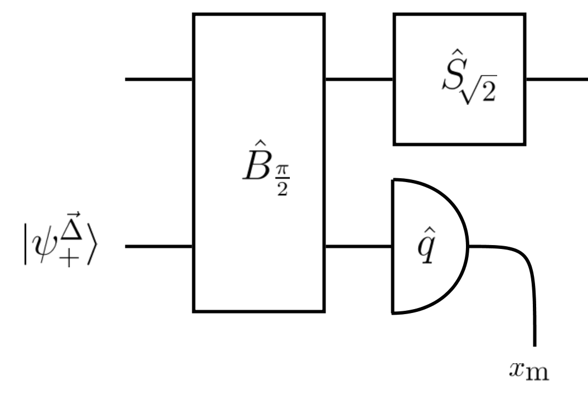
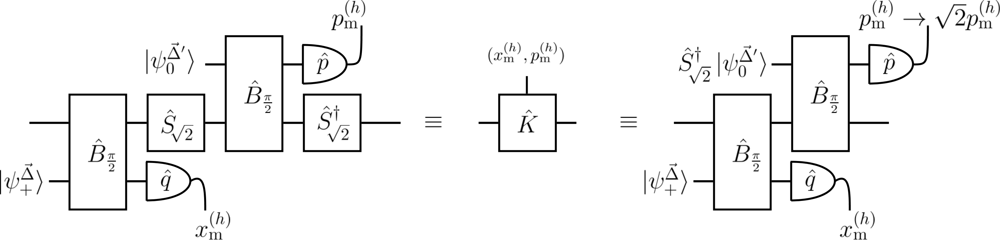
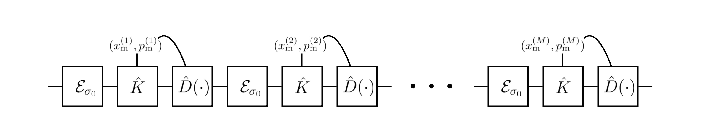
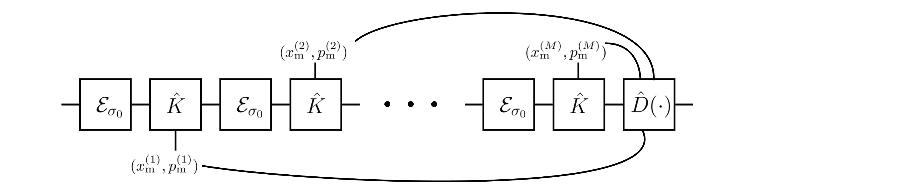
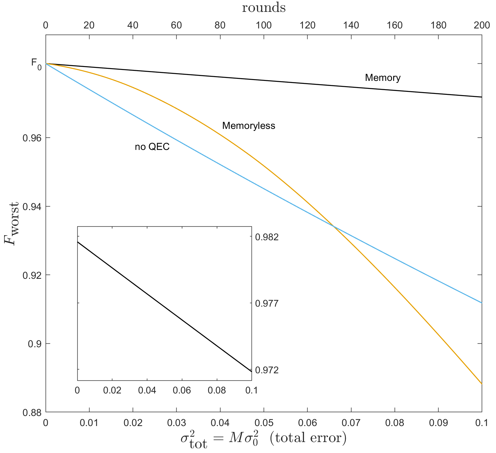
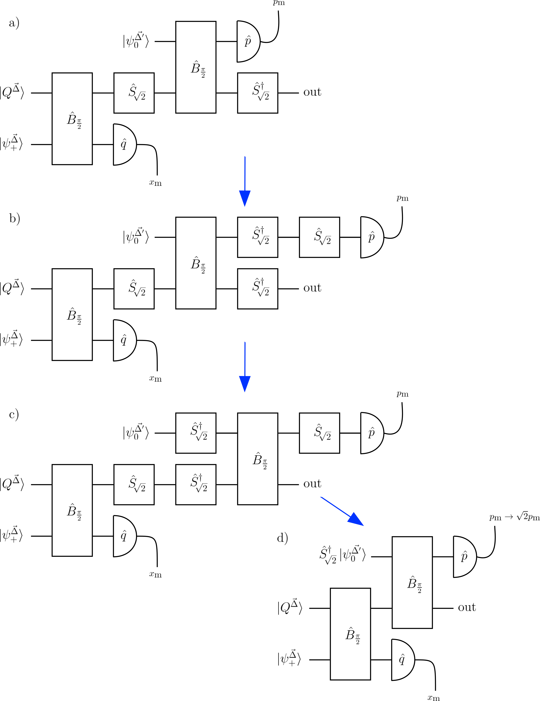

# Wan et al. (2020) 主来源阅读包（T3.2.1 范围草案）

> 状态：**task-scoped draft，不是全文翻译**。本包只为 T3.2.1 的算法来源、公式语义和 claim 边界提供可追溯证据。论文正文及附录中未逐段翻译的证明均在 `translation_notes.md` 中列出，不能把本文件当作完整 paper reader。

- 题目：*Memory-assisted decoder for approximate Gottesman-Kitaev-Preskill codes*
- 作者：Kwok Ho Wan, Alex Neville, Steve Kolthammer
- 期刊：Physical Review Research 2, 043280 (2020)
- DOI：10.1103/PhysRevResearch.2.043280
- 主来源：arXiv:1912.00829v3 的 TeX 与 PDF
- 本任务迁移：多轮观测联合形成 Bayesian posterior，并在 episode 末端做一次决策/纠正
- 本任务不迁移：有限能 GKP 波函数、Glancy–Knill q/p-SE 电路、论文的 Gaussian/Laplace 近似公式、fidelity 数值及硬件可实现性结论

## 页码索引

| PDF 页 | 内容 | 本包状态 |
|---:|---|---|
| 1 | 摘要、引言、有限能 GKP 与位移噪声 | 关键段落摘录 |
| 2–3 | q/p syndrome extraction、多轮参考系、漂移界 | 关键机制摘录 |
| 3–4 | Bayesian decoder、联合后验、末端估计 | 核心公式与边界摘录 |
| 4–5 | 数值结果、总结 | 结果范围摘录 |
| 5–10 | 定义和推导附录 | 仅定位，不声称已全文翻译 |
| 11 | tracking/truncation error 界 | 仅定位，不声称已全文翻译 |

## 术语约定

| English | 中文 | 本任务中的含义 |
|---|---|---|
| memory-assisted decoder | 记忆辅助解码器 | 使用整个有限 history，而非只看末次观测 |
| syndrome extraction (SE) | syndrome 提取 | 原论文的物理测量电路；本任务不复刻该电路 |
| cumulative displacement | 累积位移 | 多轮误差与测量诱导位移共同产生的末端位移 |
| posterior | 后验分布 | 条件于全部历史观测的隐状态概率分布 |
| MMSE estimator | 最小均方误差估计器 | 原论文取近似 Gaussian posterior 的均值 |
| tracking/truncation error | 跟踪/截断误差 | 论文近似在罕见观测或舍弃波函数分量时的失败模式 |

## 摘要与研究目标

**Source:** p.1 S001

**Original:** The paper proposes combining multiple rounds of error-syndrome extraction with Bayesian estimation for approximate GKP states under small Gaussian displacement errors.

**中文:** 论文研究有限能近似 GKP 态在小 Gaussian 随机位移下的纠错，并提出把多轮 syndrome 信息放进 Bayesian 估计，而不是每轮独立遗忘。

**Source:** p.1 S002

**Original:** The stated physical protocol is based on the Glancy–Knill syndrome-extraction scheme and applies the final correction after several rounds.

**中文:** 论文的物理对象是 Glancy–Knill syndrome-extraction 电路；其“memory-assisted”含义是多轮期间不做主动 corrective displacement，收集观测后在末端统一估计和纠正。

**T3.2.1 解释:** 当前代码只借用“历史联合后验 + 末端决策”的结构。代码的观测是仓库统一的 modular residual syndrome，隐状态是二维逻辑环面；这不是原论文电路的等价实现。

### Fig. 1. q-quadrature syndrome extraction 电路

**Placed near:** p.2 S003  
**Source:** p.2 C001

**Original caption:** q-SE uses a GKP qubit, an auxiliary state, beamsplitting, squeezing and a quadrature measurement to obtain the syndrome.

**中文图注:** q-SE 把数据 GKP qubit 与辅助态经过 beamsplitter 和 squeezing 后测量辅助模的 q quadrature，得到 syndrome。

**Reading note:** 这是论文 likelihood 的物理来源；T3.2.1 没有模拟该电路，因此不得宣称复现 Fig. 1。

## 多轮记忆机制

**Source:** p.2 S003

**Original:** After sequential q-SE and p-SE, the state is approximated as the input wavefunction with measurement- and error-dependent shifts, provided the displacements are small.

**中文:** 在小位移近似下，连续 q-SE/p-SE 后的态可写成原波函数加上由未知误差和已知 measurement-induced shift 共同构成的位移。

**Source:** p.2 S004

**Original:** For round h, the paper decomposes the final q shift into an unknown error contribution and a known contribution computed from transformed measurement outcomes.

**中文:** 对第 h 轮，论文把末端 q 位移写成两部分：多轮未知误差的加权和，以及可由变换后 measurement history 计算的已知项。历史观测不是可随意丢弃的附属信息，而是末端估计量的输入。

**Source:** p.2 Eq. (7)

\[
\theta_h(\vec{x}_{\mathrm m},\vec{u})
=\theta_h^{\mathrm{err}}(\vec{u})
-\theta_h^{\mathrm{step}}(\vec{x}_{\mathrm m}).
\]

**中文:** 该分解说明论文解码器要估计的是多轮累积未知项，而不是把最后一次 syndrome 直接阈值化。

### Fig. 2a. q/p-SE 的等效重编译

**Placed near:** p.2 S005  
**Source:** p.4 C002

**Original caption:** The q/p-SE module can be represented by a measurement-dependent Kraus operator and recompiled so squeezing is moved to auxiliary-state preparation.

**中文图注:** q/p-SE 模块可用 measurement-dependent Kraus operator 表示，并可把 squeezing 移到辅助态的离线制备。

**Reading note:** 这是实验电路层贡献，与当前 grid Bayesian filter 的软件成本模型不同。

### Fig. 2b. memoryless 路径

**Placed near:** p.2 S005  
**Source:** p.4 C002

**Original caption:** In the memoryless protocol, every syndrome immediately informs a correction and is then forgotten.

**中文图注:** memoryless 协议每轮依据当前 syndrome 立即纠正，之后不把该观测带入后续轮次。

**Reading note:** T3.2.1 的严谨对照不是这个有限能电路模拟，而是同一轨迹、同一观测字段、只保留末次观测的 static Bayesian comparator。

### Fig. 2c. memory-assisted 路径

**Placed near:** p.2 S005  
**Source:** p.4 C002

**Original caption:** The memory-assisted protocol retains all syndrome results and performs one corrective displacement after M rounds.

**中文图注:** memory-assisted 协议保存全部 syndrome 结果，在 M 轮后联合解码并执行一次 corrective displacement。

**Reading note:** 这是 T3.2.1 唯一直接迁移的机制层证据。

**Source:** p.3 S005

**Original:** Without an active correction after every round, the expected displacement remains bounded under the paper's small-error model.

**中文:** 论文证明在其小误差近似与特定 SE 变换下，多轮不做中间纠正并不会使位移无界增长；每个 quadrature 的量级界约为 \(2\sqrt{\pi}\)。

**边界:** T3.2.1 使用固定 20-cycle episode 和二维周期网格保证数值状态有界，没有把论文的 \(2\sqrt{\pi}\) 证明移植为本模型定理。

## Bayesian posterior 与末端估计

**Source:** p.3 S006

**Original:** The decoder assumes the loss/error channel is characterised, so the displacement width is known.

**中文:** 论文解码器要求误差通道已表征，即先验噪声宽度 \(\sigma_0\) 已知。由此可知，memory-assisted 并不等同于无需校准的自适应解码。

**Source:** p.3 Eq. (9)

\[
P(u\mid x_{\mathrm m}) \propto
P(x_{\mathrm m}\mid u)P(u).
\]

**中文:** 单轮 posterior 由 GKP-comb likelihood 与 Gaussian displacement prior 相乘得到。论文随后在 \(\Delta,\sigma_0\ll\sqrt\pi\) 下用 Gaussian 近似，并以 posterior mean 作为 MMSE 估计。

**Source:** p.3 S007

**Original:** For multiple rounds, Bayes' theorem is applied to all M measurement outcomes and all M displacement variables.

**中文:** 多轮情形把全部历史 measurement likelihood 与每轮 Gaussian prior 联合起来，形成关于位移向量 \(\vec u\) 的 posterior；目标是该向量某个线性组合对应的末端累积位移。

**Source:** p.3 Eq. (12)

\[
P_M^{(q)}(\vec u\mid\vec x_{\mathrm m})
\propto\prod_{h=1}^{M}
\psi_+^{\vec\Delta}(\sqrt2 x_{\mathrm m}^{(h)}-\mathcal U_h)
G_{\sigma_0}(u_h).
\]

**中文:** 这是“用整个 history 更新联合 posterior”的主来源锚点。T3.2.1 没有复用此 closed-form comb likelihood，而是在逻辑环面上用 periodic Gaussian transition/observation 做递归 Bayesian filtering。

**Source:** p.3–4 S008

**Original:** Under small-width assumptions the multiround posterior is approximated by a multivariate Gaussian, and the posterior mean supplies the final MMSE correction.

**中文:** 论文通过 multivariate Gaussian/Laplace 近似得到可计算的末端 estimator 和 uncertainty。当前实现则保留离散的完整 posterior mass，不声称采用或验证论文的该近似展开。

## 数值证据与论文自身边界

### Fig. 3. 原论文 fidelity 对比

**Placed near:** p.4 S009  
**Source:** p.4 C003

**Original caption:** The figure compares memory-assisted, memoryless and no-QEC fidelity for one selected finite-energy GKP parameter set.

**中文图注:** 图中在一个特定有限能 GKP 参数组下比较 memory-assisted、memoryless 与不纠错的 qubit fidelity。

**Reading note:** 论文的指标是 density-matrix-derived qubit fidelity；T3.2.1 的指标是冻结 synthetic modular-syndrome episode 上的逻辑分类错误率、NLL 和 Brier score，二者不可数值对齐。

**Source:** p.4 S009

**Original:** The reported simulation uses \(\Delta=\kappa\approx0.22\), mean boson number around ten, and a selected Gaussian error width.

**中文:** 原论文数值结论绑定于有限能态、选定 squeezing/噪声参数和其 density-matrix fidelity 计算。它只能支持机制启发，不能替代本仓库独立的 trace-level 验证。

**Source:** p.5 S010

**Original:** The conclusion is framed for the studied Gaussian-displacement model and approximate GKP recovery protocol.

**中文:** 论文的改进结论不应外推为任意噪声、任意 episode 长度或任意硬件上的普适历史增益。

## 附录失败模式定位

**Source:** p.9–11 S011

**Original:** The appendices analyse tracking errors from unlikely observations or large shifts, and truncation errors caused by retaining only a dominant wavefunction term.

**中文:** 附录明确承认两类近似失败：罕见观测/大位移可让 measurement peak 跟踪错误；只保留 dominant term 会产生 truncation error。论文对给定参数给出界，但这些界依赖其波函数与电路模型。

**T3.2.1 对应检查:** 当前实现不使用 dominant-wavefunction truncation；它通过完整网格 posterior、production/reference grid 对比、proper scoring rules 和输入 fail-close 检查自己的数值近似。两套误差分析不可互相替代。

### Fig. 4. offline squeezing 推导

**Placed near:** p.5 S010  
**Source:** p.10 C004

**Original caption:** The diagram derives how squeezing may be shifted from the data-mode circuit into auxiliary-state preparation.

**中文图注:** 该图以电路恒等变换说明如何把数据模路径中的 squeezing 转移到辅助态的离线制备。

**Reading note:** 这是物理电路简化，不是 FPGA decoder synthesis 证据。

## 对 T3.2.1 的可审计结论

1. 可以迁移：有限 history 的全部因果观测共同更新 posterior，末端只做一次逻辑决策。
2. 必须冻结：history length、episode 起点、transition/measurement covariance、可见观测字段和决策时刻。
3. 必须独立验证：相关二维噪声、网格收敛、proper scores、同轨迹 static comparator 和无 truth leakage。
4. 不可声称：原论文 finite-energy circuit fidelity 复现、其近似公式的等价实现、device calibration、FPGA synthesis 或普适优越性。

