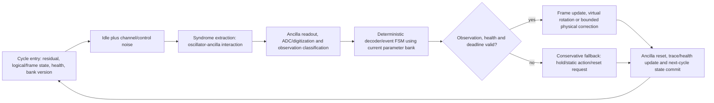

# T0.1.2 平台抽象冻结：cavity–transmon primary mapping 与平台无关数学核心

**Task ID：** `T0.1.2`  
**日期：** 2026-07-14  
**状态：** `Done`  
**前置 contract：** `docs/tasks/T0.1.1_scope_freeze.md`

## 1. 冻结结论

主平台映射冻结为：

> 用 superconducting microwave storage cavity 的单个电磁模式承载 square approximate GKP logical qubit，以 transmon-like ancilla、dispersive/conditional-displacement interaction、ancilla readout/reset 和 classical feedback 完成 repeated syndrome extraction 与 correction/frame update；经典 fast path 由 FPGA-like deterministic controller 承担，慢速估计/优化由 host CPU/GPU 承担。

同时，论文和代码的数学核心保持平台无关：只依赖“bosonic mode + ancilla-assisted observation + classical controller + actuator”的状态、观测、动作与时序 contract，不依赖某一台 cavity、某一种 ECD pulse 或某一块 FPGA 才能成立。

此处“主平台映射”是建模与接口选择，不是当前仓库已经接入真实 cavity/transmon 的证据。

## 2. 文献与仓库证据锚点

| 证据 | 支持的抽象 | 不支持的扩展 claim |
| --- | --- | --- |
| `relative_papers/Quantum_error_correction_of_a_qubit_encoded_in_grid_states_of_an_oscillator/Quantum_error_correction_of_a_qubit_encoded_in_grid_states_of_an_oscillator.md` Fig. 1 与正文 | 单 oscillator grid state、transmon conditional displacement、transmon measurement-conditioned oscillator feedback、每轮 reset | 不能把该实验装置参数视为本仓库已校准参数 |
| `relative_papers/Real-time_quantum_error_correction_beyond_break-even/Real-time_quantum_error_correction_beyond_break-even.md` Fig. 1、Fig. 2 与 QEC-cycle 说明 | cavity + transmon ancilla、readout/reset、FPGA orchestrator、GPU optimizer、sBs 奇偶子周期和 real-time decision | 文献的 `4.924 us` 子周期和 `2×4.924 us` full cycle 不是本项目廉价板卡实测 deadline |
| `relative_papers/Non-Markovian_feedback_for_optimized_quantum_error_correction/Non-Markovian_feedback_for_optimized_quantum_error_correction.md` | history-dependent feedback/teacher 的物理动机 | 不证明当前 controller 已实现或可部署 |
| `physics/` | 有效位移噪声、modular syndrome、线性 correction、跨轮 residual/LER tracking | 未实现 ECD/sBs pulse、transmon IQ readout、leakage/reset state machine 或真实 ADC |
| `cnn_fpga/` | 主机/快路径、定点、runtime/HIL 的既有工程基础 | 现有软件 HIL 不等于 cavity/transmon HIL 或板级实测 |

## 3. 平台无关数学 contract

每个子周期使用以下抽象变量：

- `x_t`：隐藏物理/逻辑状态，至少包含连续 residual shift、logical/Pauli frame、离散健康/泄漏状态和环境参数；
- `n_t`：idle/channel/control noise；
- `m_t`：measurement/readout noise、misclassification 和 observation-validity 扰动；
- `r_t`：reset/actuation 随机性，包括 reset failure 和 requested/applied action 差异；
- `y_t`：可观测记录，可包含 analog/residual syndrome、I/Q 或分类后的 `g/e/leakage`、quadrature phase、readout validity；
- `h_t`：经典 controller memory，包括 recent history、run length、confidence、parameter-bank version、deadline/health flags；
- `a_t`：correction/frame/virtual-rotation/reset-request/fallback action；
- `phi_t`：当前可原子切换的 decoder/controller 参数。

平台无关关系写为：

\[
x_t^- = F_{\mathrm{idle}}(x_t,n_t),\qquad
y_t = H_{\mathrm{extract/readout}}(x_t^-,m_t),
\]

\[
(a_t,h_{t+1}) = \Pi_{\phi_t}(y_t,h_t),\qquad
x_{t+1}=F_{\mathrm{act/reset}}(x_t^-,a_t,r_t).
\]

任何平台只需给出 `F`、`H`、动作可用集合、cycle deadline 和失败语义，即可复用同一 classical-control/decoder contract。T0.1.3 再冻结字段、更新频率、位宽和 fallback policy；本 task 不提前锁定位宽。

## 4. 冻结的 cycle diagram



与任务板要求的一一对应关系：

```text
idle noise
  -> syndrome extraction
  -> ADC / measurement
  -> decoder / event-state decision
  -> frame update or bounded correction (or explicit fallback)
  -> reset, state commit and next cycle
```

## 5. 各阶段 I/O、主平台映射与当前实现

| 阶段 | 输入 | 输出 | cavity–transmon primary mapping | 当前仓库实现状态 |
| --- | --- | --- | --- | --- |
| Cycle entry | residual/frame、health、bank version | 本轮初始状态 | storage mode + controller registers | `logical_tracking.py` 有 residual；frame/health/bank 尚不完整 |
| Idle/noise | `x_t`、噪声参数、上轮动作 | `x_t^-` | cavity loss/dephasing/Kerr、transmon-induced/control error | `noise_channels.py` 提供 Wigner/effective proxy；非 pulse-level |
| Syndrome extraction | `x_t^-`、quadrature/protocol phase、control parameters | ancilla-correlated state | ECD/conditional displacement 或 sBs constituent unitary | 当前 `SyndromeMeasurement` 直接从 displacement 取模，未实现 ancilla interaction |
| Measurement/ADC | ancilla state、readout chain | I/Q、analog syndrome 或 `g/e/leakage` + validity | readout resonator、amplification、ADC、classifier | 只有有效测量噪声和 ancilla-error proxy；无 waveform/IQ/ADC model |
| Decoder/event FSM | observation、history、current bank | action、confidence、fallback reason | FPGA deterministic path | `error_correction.py` 有线性 decoder；`cnn_fpga/` 有既有 fast-loop 基础；新 event FSM 待 T4 |
| Frame/correction | action、current frame | updated frame/physical state | Pauli/phase frame、virtual rotation、可选 displacement | 当前只返回 correction vector；frame/virtual-rotation state 未完整建模 |
| Reset/commit | readout/leakage state、action result | reset status、trace、`x_{t+1}` | transmon `g/e/f` reset、controller state commit | 当前无 `g/e/f` reset/leakage streak state machine；由 T2.0.3/T2.0.4 实现 |
| Slow update | windowed observations、uncertainty、cost | new inactive bank + version/CRC | host CPU/GPU estimation/optimization | `cnn_fpga/` 有既有慢路径；新协议字段和原子切换由 T0.1.3/T4.3 冻结 |

## 6. 物理平台与数字控制边界

### 6.1 量子/模拟域

- storage cavity/oscillator 承载 GKP state；
- transmon-like ancilla 负责 syndrome extraction、readout 和 reset；
- microwave/AWG/virtual-frame actuator 实现 conditional displacement、virtual rotation 或物理 correction；
- cavity loss、thermal excitation、dephasing/Kerr、transmon bit/phase error、readout confusion 和 leakage 属于物理/观测扰动。

### 6.2 FPGA fast path

- 只消费数字化后的 observation 与已提交 parameter bank；
- 只执行有界、确定性、worst-case latency 可证明的 decoder/FSM/student；
- 更新 frame/action、health、counter 和 trace；
- 不在逐周期 critical path 训练 CNN/RNN，也不执行物理 squeezing 或量子态制备优化。

### 6.3 Host slow path

- 聚合多轮 syndrome/event/history；
- 估计连续 drift、离散 regime、uncertainty 和推荐参数；
- 离线训练/搜索 teacher，或构造新 parameter bank；
- 通过 version/CRC/timestamp 提交完整 bank，不能半更新 fast path。

## 7. Correction 与 frame 的优先级

1. 若等价的 Pauli/phase-frame update 足以表达动作，优先 frame update，避免不必要物理脉冲；
2. protocol-required virtual rotation 作为受控动作单列，不能与 Pauli frame 混称；
3. 只有协议确实需要且 actuator 可用时执行 physical displacement；
4. readout invalid、leakage、deadline miss 或 bank unhealthy 时不得生成未定义 correction，必须进入 fallback/hold/reset-request 分支；
5. 当前软件 correction vector 只是动作语义的代理，不证明真实 actuator 已执行。

## 8. 失败分支 contract

| 失败事件 | fast-path 必须行为 | next-cycle 状态 | 记录要求 |
| --- | --- | --- | --- |
| ADC/readout invalid 或 classifier 低置信 | 禁止激进 correction；执行 static/hold fallback | 保留或安全更新 frame，增加 invalid counter | raw/quantized observation、reason、action |
| 检测到 `f`/higher leakage | 发出 reset request，进入 recovery/hold | 增加 leakage run length，直到 reset confirmation | leakage class、duration、reset outcome |
| reset failure/storm | 限制动作并维持 fallback | health 降级，必要时暂停 active correction | attempt count、timeout、availability |
| parameter bank stale/CRC/version mismatch | 继续使用最后一个完整健康 bank或 static fallback | 不允许半更新 bank 生效 | active/inactive version、CRC、reason |
| deadline miss/FIFO overflow | 不执行迟到的激进行为 | 标记 miss 并按安全策略提交下一状态 | enqueue/dequeue/cycle timestamp、overflow source |
| host timeout | fast path 自主维持安全 baseline | bank age 增长，超过阈值进入 stale fallback | last host update、age、fallback transition |
| physical actuator unavailable | 优先 frame-only；若协议不允许则 hold/fallback | 明确 action not applied | requested/applied action 分离 |

## 9. 时序与 claim 边界

- `4.924 us` 是 beyond-break-even 文献中一个 constituent dissipator 的实验时序；文献 full QEC cycle 为两个正交子周期，写作时必须保持该上下文。
- 本项目廉价 FPGA 的 core latency、transport latency 和 end-to-end latency 均尚未由 T6 实测，不能从文献时序反推。
- 软件函数调用耗时、Python HIL runtime、synthesis estimate 和真实 board measurement 是四类不同证据。
- 当前仓库没有 cavity/transmon、microwave/AWG、ADC 或真实 reset 链路；平台映射只能写为 `experiment-informed` / `protocol-aligned` abstraction。

## 10. 非 demo / 非伪实现审计

| 检查 | 结果 | 处理 |
| --- | --- | --- |
| cycle 是否只有一张无 I/O 的概念图 | 否；每阶段均定义输入、输出、物理映射、代码状态和失败语义 | 通过 |
| 是否映射现有代码 | `GKPErrorCorrector.run_qec_round` 本地 conda smoke 返回 `syndrome/correction/residual/success/error`，验证软件有效链路存在 | 通过，但只限软件代理 |
| 是否把现有代理伪装成 transmon/ECD/ADC 实现 | 否；interaction、IQ/ADC、reset/leakage 状态机均列为缺口 | 通过 |
| 是否混淆文献 cycle time 与本项目 deadline | 否；文献时序单列且禁止移植为板级结果 | 通过 |
| 是否平台无关 | 数学 contract 只依赖状态、观测、动作、时序和失败语义；primary mapping 与 core contract 分层 | 通过 |
| 是否抢占 T0.1.3/T2.0 | 未冻结位宽/频率，也未实现 sBs state machine | 通过 |

审计结论：平台抽象不仅是图示，而是可由后续模块逐项实现和验收的 stage contract；当前完成的是架构冻结，不是物理数字孪生完成。

## 11. 完成判据与后续接口

- primary platform、platform-independent core、cycle diagram、阶段 I/O 与失败分支已冻结；
- cavity/transmon 文献事实与当前软件实现边界分离；
- 当前代码复用点与缺失的 physical/readout/reset state machine 均可追溯；
- T0.1.3 可在此基础上冻结双回路字段、频率、位宽与 fallback；
- T2.0 可实现 sBs-first protocol layer，而不改变本 task 的平台无关数学 contract。
